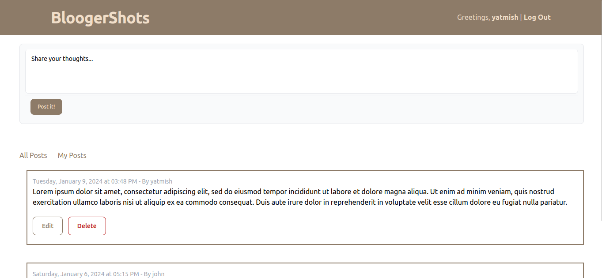

<p align="center"></p>
<h3 align="center">BloogerShots</h3>

  <p align="center">
    Blog system built with ExpressJS and EJS.
    <br />
    <a href="https://github.com/melogtm/bloogershots"><strong>Explore the docs »</strong></a>
    <br />
    <br />
    <a href="https://github.com/melogtm/bloogershots">View Demo</a>
    ·
    <a href="https://github.com/melogtm/bloogershots/issues">Report Bug</a>
    ·
    <a href="https://github.com/melogtm/bloogershots/issues">Request Feature</a>
  </p>
</div>

<details>
  <summary>Table of Contents</summary>
  <ol>
    <li><a href="functionalities">Functionalities</li>
    <li>
      <a href="#getting-started">Getting Started</a>
      <ul>
        <li><a href="#prerequisites">Prerequisites</a></li>
        <li><a href="#installation">Installation</a></li>
      </ul>
    </li>
  </ol>
</details>

## Functionalities
- [X] Login/Signup to the application
- [X] Create articles
- [X] View list of all the articles
- [X] Edit/Delete his/her own articles

<!-- GETTING STARTED -->
## Getting Started

### Prerequisites
* nodejs
* npm
  ```sh
  npm install npm@latest -g
  ```

### Installation

1. Clone the repo
   ```sh
   git clone https://github.com/melogtm/bloogershots
   ```
2. Install NPM packages
   ```sh
   npm install
   ```
3. Run server, you can set up another port if ```3000``` is being used
   ```sh
   npm run node
   ```

<p align="right">(<a href="#readme-top">back to top</a>)</p>
